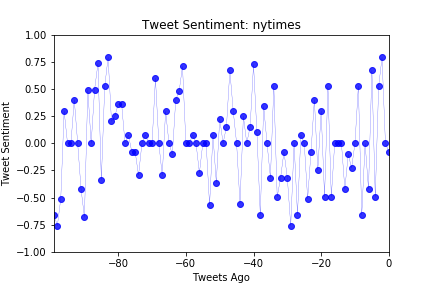

# news_sentiments
## News Mood

In this assignment, you'll create a Python script to perform a sentiment analysis of the Twitter activity of various news oulets, and to present your findings visually.

Your final output should provide a visualized summary of the sentiments expressed in Tweets sent out by the following news organizations: __BBC, CBS, CNN, Fox, and New York times__.

The first plot will be and/or feature the following:

* Be a scatter plot of sentiments of the last __100__ tweets sent out by each news organization, ranging from -1.0 to 1.0, where a score of 0 expresses a neutral sentiment, -1 the most negative sentiment possible, and +1 the most positive sentiment possible.
* Each plot point will reflect the _compound_ sentiment of a tweet.
* Sort each plot point by its relative timestamp.

The second plot will be a bar plot visualizing the _overall_ sentiments of the last 100 tweets from each organization. For this plot, you will again aggregate the compound sentiments analyzed by VADER.

The tools of the trade you may need for your task as a data analyst include the following: tweepy, pandas, matplotlib, seaborn, and VADER.

Your final Jupyter notebook must:

* Pull last 100 tweets from each outlet.
* Perform a sentiment analysis with the compound, positive, neutral, and negative scoring for each tweet. 
* Pull into a DataFrame the tweet's source acount, its text, its date, and its compound, positive, neutral, and negative sentiment scores.
* Export the data in the DataFrame into a CSV file.
* Save PNG images for each plot.

* NYTimes - Overall Compound Negative Bias 

* CNN - Overall Marginal Compound positive Bias

* BBC - Overall Neutral Compound Bias

* CBS - Overall Positive Compound Bias

* Fox - Overall Positive Compound Bias

* Overall Sentiment Bar Chart - Conclusions
* News Paper Sentiment Analysis
* NTYTimes and Fox news have negative coorelation
* BBC has an overall neutral bias
* CBS has a strong positive bias

